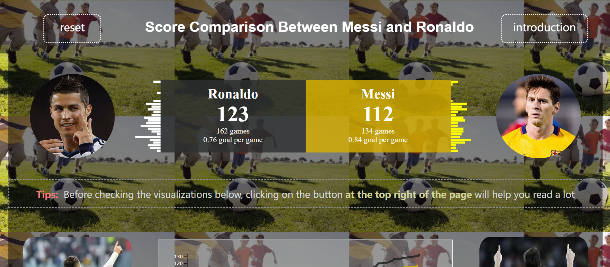
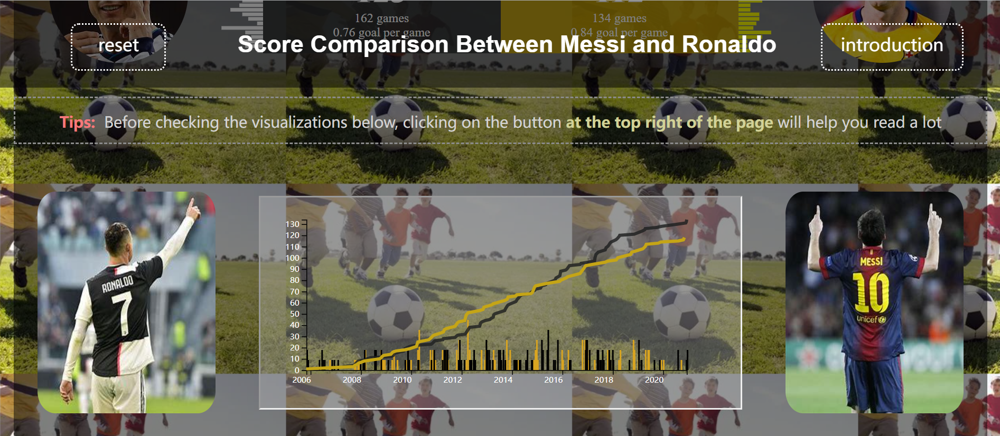
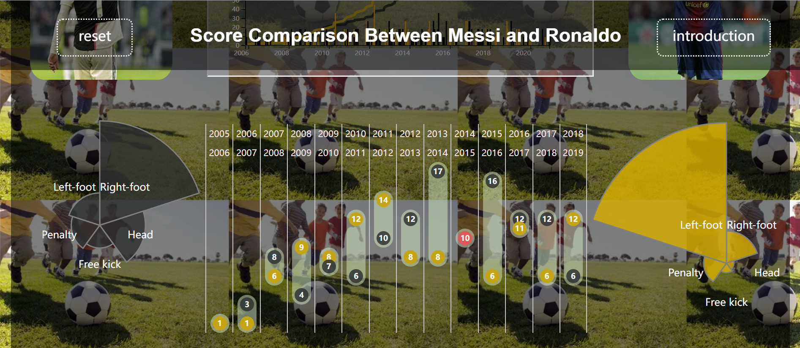
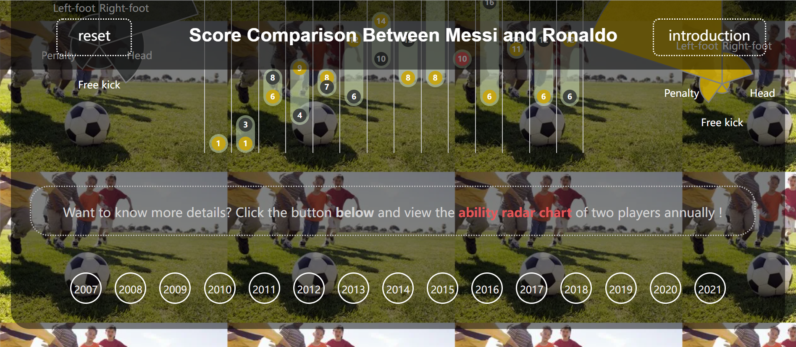
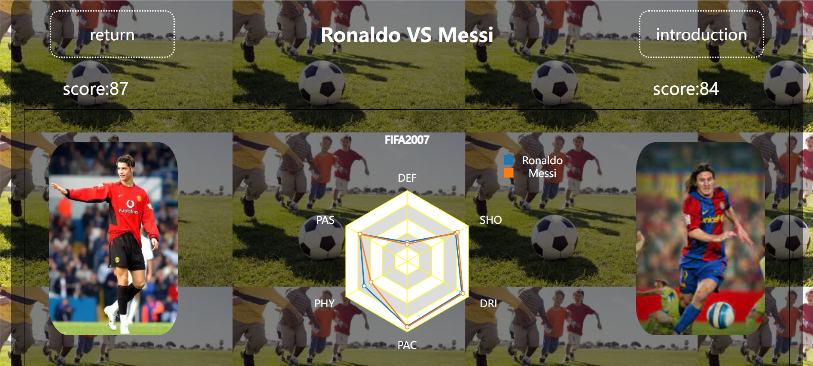
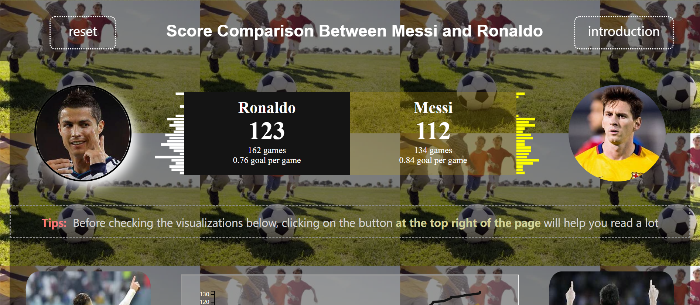
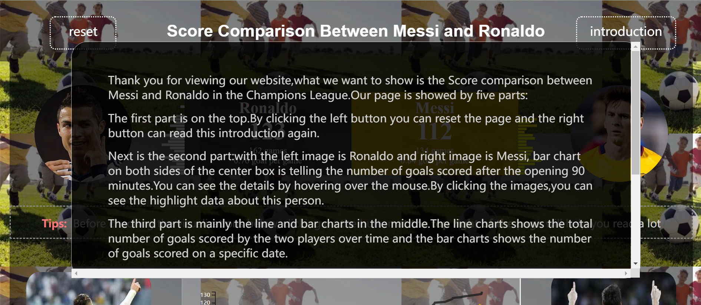
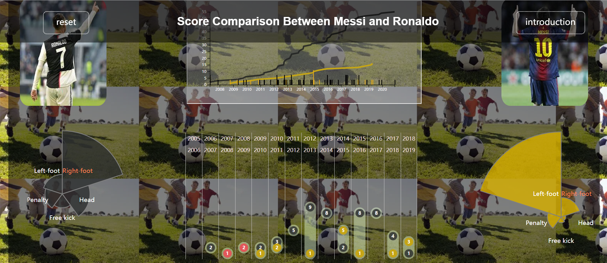
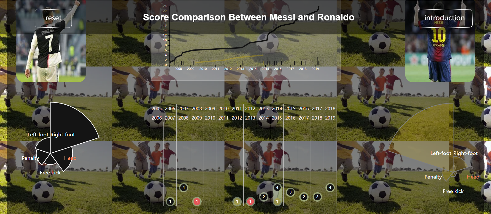

## 梅西和C罗欧冠赛场进球数的比较
该页面使用**html+css+js+d3.js**做出的进行梅西C罗进球分析比较的页面，包括条形图+玫瑰图+点状图+雷达图+美观页面

**条形图**包括头像旁边的条形图以及页面中部的条形图，前者表示的是开场90分钟内每5分钟的进球数，后者表示随年份增长二人进球数的总数对比

**玫瑰图**包括如下方图三左右两侧的图，表示二人不同进球方式的进球数对比，圆弧半径的长短与进球数的多少成正比

**点状图**为两个玫瑰图中间的图，表示二人在不同赛季的进球数对比

**雷达图**需要通过页面最下方的年份按钮跳转，然后展现出来的是表示二人各种能力值的雷达对比图

### 静态页面如下

### 动态效果如下
1. 点击头像产生高亮效果

   

2. 点击左上角return刷新页面

3. 点击右上角introduction出现弹窗介绍整个页面

   

4. 点击玫瑰图的不同部分，相应的点状图条形图都会发生数据变化

   

5. 点击头像后再点击玫瑰图的不同部分，相应的点状图条形图会发生数据变化，同时产生高亮

   

6. 点击页面最下方的年份，会跳转到对应年份展示表示二人能力对比的雷达图界面

   

页面参考https://public.tableau.com/app/profile/the.information.lab.italia/viz/Messi-Ronaldo_0/Messi-Ronaldo

数据为二人欧冠赛场上的数据
