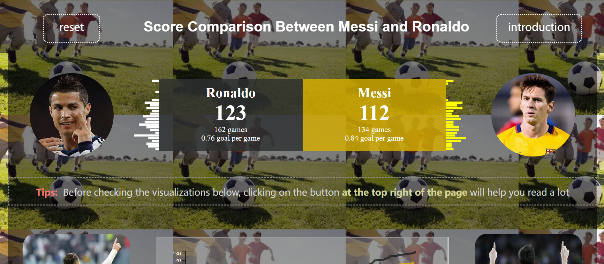
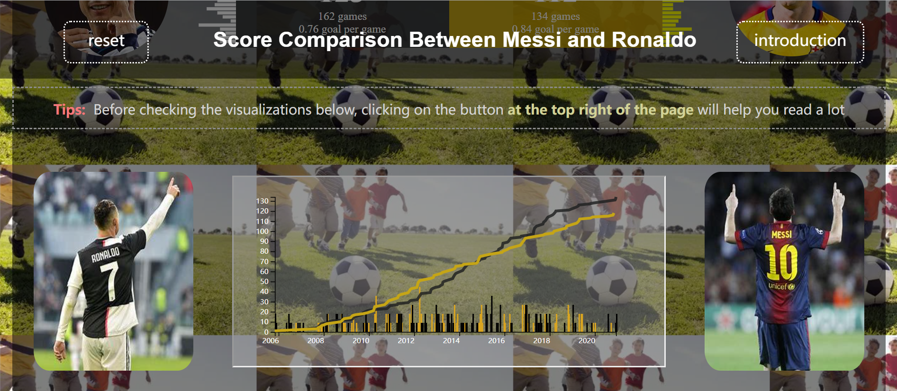
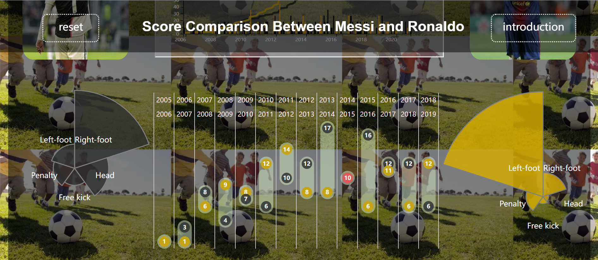
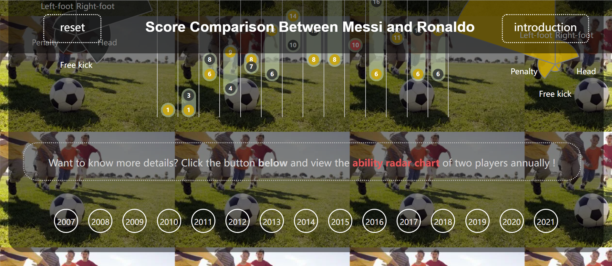
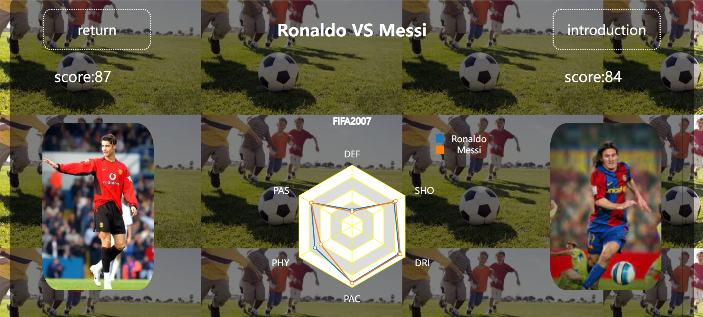

# 梅西和C罗欧冠赛场进球数的比较
该页面使用**html+css+js+d3.js**做出的进行梅西C罗进球分析比较的页面，包括条形图+玫瑰图+点状图+雷达图+美观页面

# 静态页面如下：

# 动态效果有：
1. 点击头像产生高亮效果
2. 点击左上角return刷新页面
3. 点击右上角introduction出现弹窗介绍整个页面
4. 点击玫瑰图的不同部分，相应的点状图条形图都会发生数据变化，同时产生高亮效果
5. 点击页面最下方的年份可以跳转到雷达图界面
